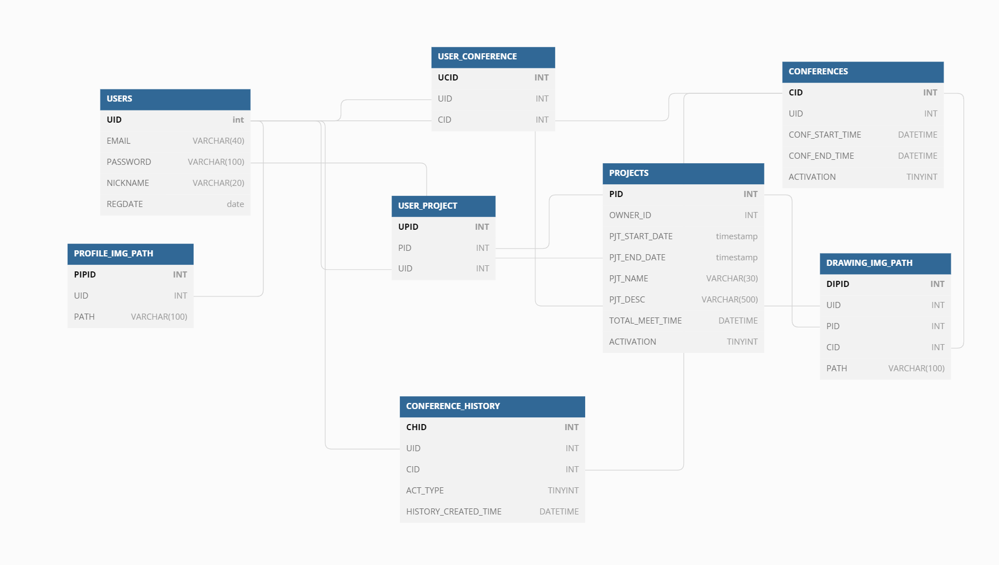
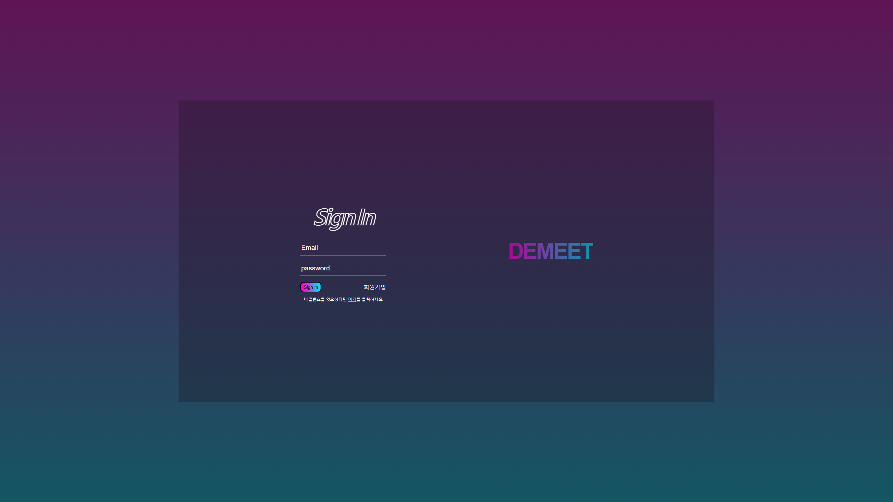
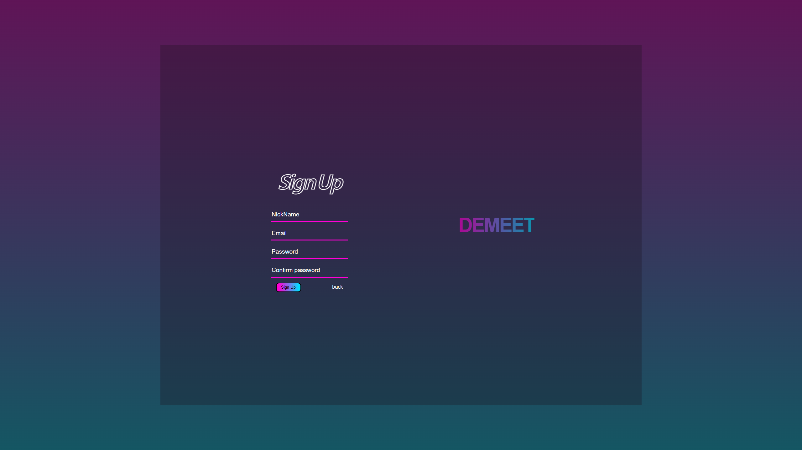
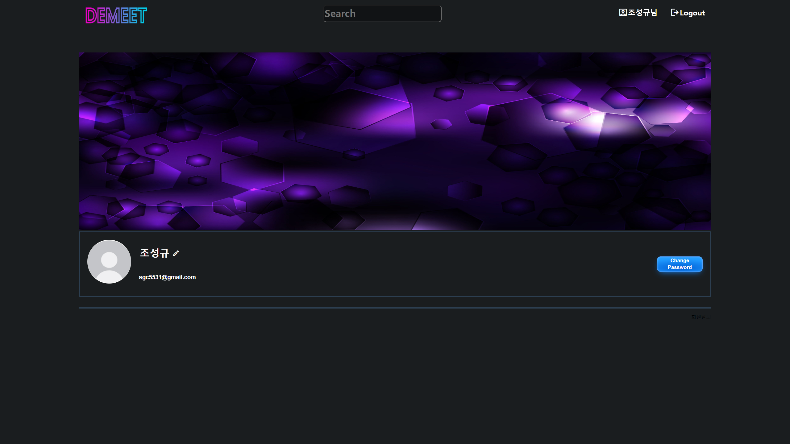
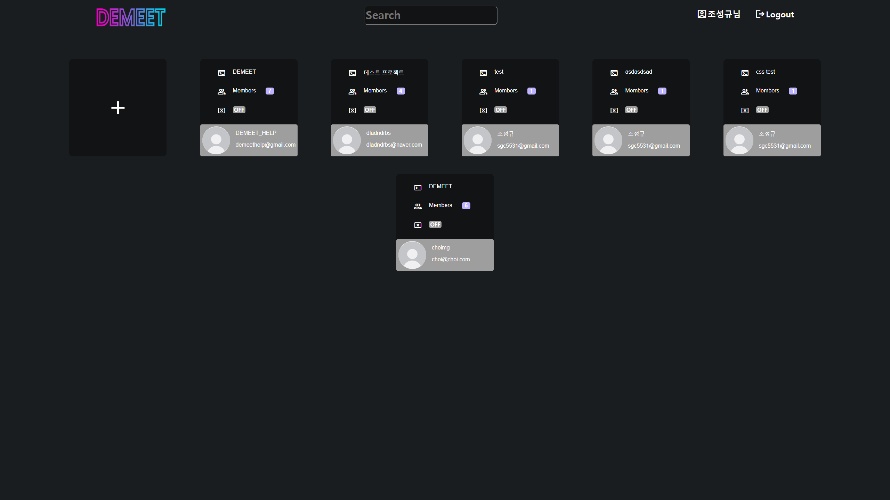
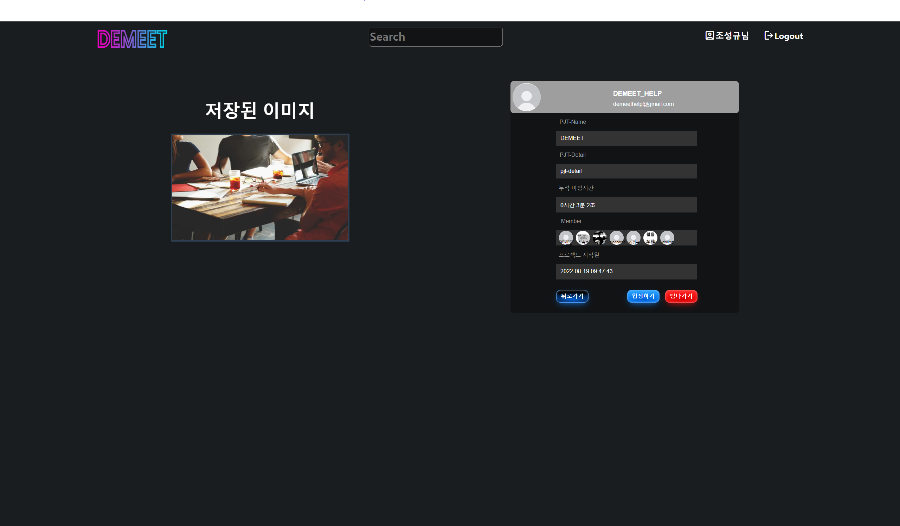
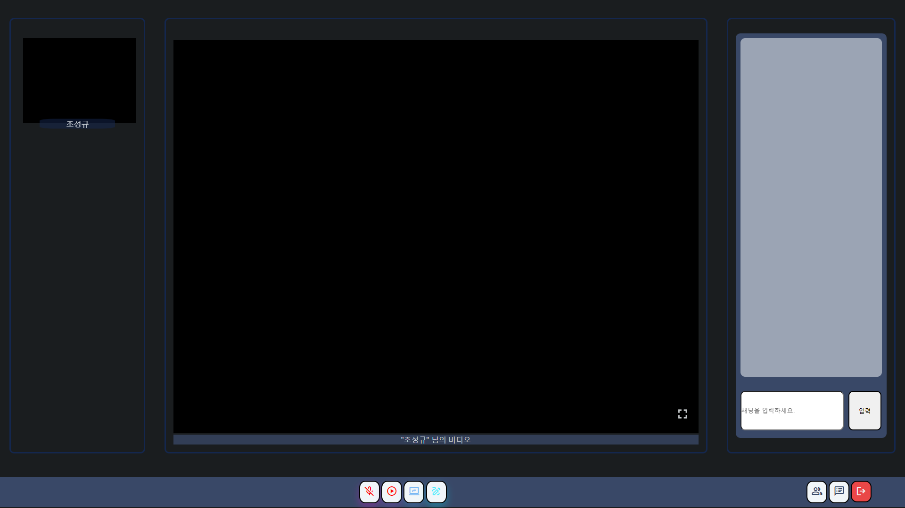
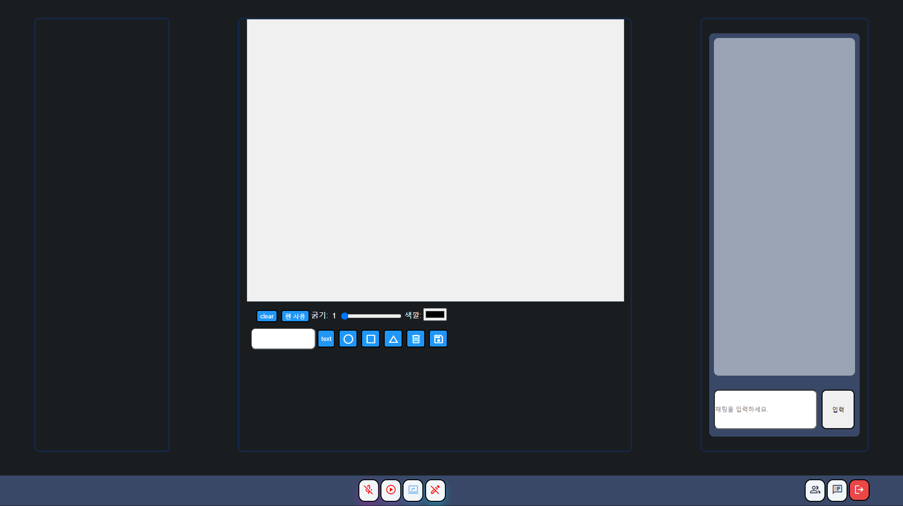

# DEMEET - 웹 기술 프로젝트

------

## **프로젝트 소개**

### 서비스 특징

프로젝트 기획을 보조하는 화상회의 서비스

### 주요 기능

- 화상회의 서비스
- 아이디어 구상을 위한 드로잉 기능 + 동시 편집 기능
- 회원 관리 (회원가입, 로그인, 비밀번호 변경 ETC.)
- 프로젝트 관리(산출물 저장, 팀원관리, 화상회의)

### 주요 기술

- WebRTC
- WebSocket
- JWT Authentication
- REST API
- CRDT 알고리즘

### 개발환경

- FE: Vue 3, JavaScript, HTML5, OpenVidu, fabric.js, yorkie
- BE: Java 1.8, Spring Boot 2.4.5 , JPA 2.4.8 DB : MySQL 8.0.29, Amazon S3
- 운영체제 : Windows 10, MacOS 12
- 서버 : Amazon ec2 Instance, Ubuntu 20.04

### 참조 리소스

- openvidu : 화상미팅의 전반적인 기능에 사용
- fabric.js : 캔버스 구현에 사용
- yorkie : 동시 편집기능에 사용
- AWS : 서버
- WhoisXMLAPI : 이메일 인증에 사용

### 배포 환경

- URL: https://i7b309.p.ssafy.io/
- 테스트 계정:이메일 : [demeethelp@gmail.com](mailto:demeethelp@gmail.com) , 비밀번호 : demeet123

### **팀 소개**

- 김대원: 팀장, 백엔드, 동시편집 로직 구현
- 이정건: 프론트엔드, 배포
- 임웅균: 백엔드 파트장, 백엔드
- 장종훈: 프론트 파트장, 프론트엔드, 드로잉
- 조성규 : 프론트엔드, 화상회의
- 최명권 : 프론트엔드, 드로잉, 화상회의

#### **ERD**

`https://dbdiagram.io/d/62d6e2280d66c746550997fa`

`https://www.notion.so/wondaeme/ERD-cb0166f9c02e4dbd9f75153c127e60ed`

#### **와이어 프레임**

`https://www.figma.com/file/liftpB4h1hnwkfVaHz72EH/DEMEET-WIREFRAME?node-id=0%3A1`

#### **API**

`https://www.notion.so/wondaeme/API-1e734e67a2f542e7a8adb9dfca82ab58`

### **기능 설명**

#### 회원 관리

- 이메일 인증
- 회원 관리 (회원가입, 로그인, 비밀번호 변경 ETC.)

#### 프로젝트 관리

- 산출물 저장
- 누적 미팅 시간
- 멤버 추가 및 제거(팀장)
- 프로젝트 시작 시간
- 회의 시작하기, 회의 종료하기(팀장)
- 입장하기, 팀 나가기(팀원)

#### 화상 회의

- 음소거 기능(발신만)
- 화면공유 기능
- 드로잉 기능(실행시 하얀 캔버스 화면공유)
- 동시편집기능(배포X)

#### 프로필

- 닉네임변경
- 비밀번호변경
- 종료한 프로젝트 정보 자동 보관
  - 프로젝트 개요
  - 산출물

### 기능 흐름

#### 로그인 화면

#### 회원가입

#### 마이페이지

#### 메인 페이지

#### 프로젝트 디테일

#### 화상 미팅 화면

#### 캔버스 공유 화면

