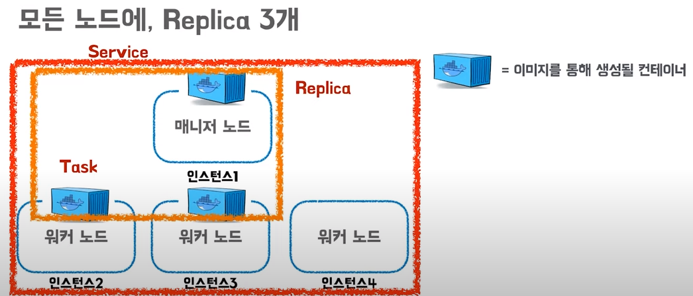

1. 호스트만 회의내용을 녹화할 수 있는가? 녹음만 가능할 수는 없는가?, 녹화한다면 서버에 저장하지 않고 호스트가 바로 저장할 수는 없는가?

```html
## 화면만 녹화 - https://medium.com/watcha/%EC%9B%B9%EB%B8%8C%EB%9D%BC%EC%9A%B0%EC%A0%80%EC%97%90%EC%84%9C-%EB%8F%99%EC%9E%91%ED%95%98%EB%8A%94-%EB%85%B9%ED%99%94%EC%95%B1-%EB%A7%8C%EB%93%A4%EA%B8%B0-70142ce28994
<!DOCTYPE html>
<html lang="en">
<head>
  <meta charset="UTF-8">
  <meta http-equiv="X-UA-Compatible" content="IE=edge">
  <meta name="viewport" content="width=device-width, initial-scale=1.0">
  <title>Document</title>
  <!-- <script src="app.js" defer></script> -->
</head>
<body>
  <video id="recorded-video" controls></video>
  <video id="video-output"></video> 
  <button id="start-btn">녹화 시작</button>
  <button id="finish-btn">녹화 종료</button>
  <button id="download-btn">다운로드</button>
  <script>

    const videoOutput = document.getElementById('video-output');
    const startBtn = document.getElementById('start-btn');
    const downloadBtn = document.getElementById('download-btn');
    const finishBtn = document.getElementById('finish-btn');
    const recordedVideo = document.getElementById('recorded-video');

    let mediaStream = null;
    let mediaRecorder = null;
    let recordedMediaURL = null;

    // 유저의 카메라로 부터 입력을 사용할 수 있도록 요청
    navigator.mediaDevices
    .getUserMedia({ video: true })
    .then(function (newMediaStream) {
      mediaStream = newMediaStream;

      // 카메라의 입력을 실시간으로 비디오 태그에서 확인
      videoOutput.srcObject = mediaStream;
      videoOutput.onloadedmetadata = function (e) {
        videoOutput.play();
      };
    });

    // 녹화 시작 버튼 클릭 시 빌생하는 이벤트 핸들러 등록
    startBtn.addEventListener('click', function () {
      let recordedChunks = [];
      // 1.MediaStream을 매개변수로 MediaRecorder 생성자를 호출
      mediaRecorder = new MediaRecorder(mediaStream, {
            mimeType: 'video/webm;',
          });

          // 2. 전달받는 데이터를 처리하는 이벤트 핸들러 등록
          mediaRecorder.ondataavailable = function (event) {
            if (event.data && event.data.size > 0) {
              console.log('ondataavailable');
              recordedChunks.push(event.data);
            }
          };

          // 3. 녹화 중지 이벤트 핸들러 등록
          mediaRecorder.onstop = function () {
            // createObjectURL로 생성한 url을 사용하지 않으면 revokeObjectURL 함수로 지워줘야합니다.
            // 그렇지 않으면 메모리 누수 문제가 발생합니다.
            if (recordedMediaURL) {
              URL.revokeObjectURL(recordedMediaURL);
            }

            const blob = new Blob(recordedChunks, { type: 'video/webm;' });
            recordedMediaURL = URL.createObjectURL(blob);
            recordedVideo.src = recordedMediaURL;
          };

          mediaRecorder.start();
        });

        // 녹화 종료 버튼 클릭 시 빌생하는 이벤트 핸들러 등록
        finishBtn.addEventListener('click', function () {
          if (mediaRecorder) {
            // 5. 녹화 중지
            mediaRecorder.stop();
          }
        });

        // 다운로드 버튼 클릭 시 발생하는 이벤트 핸들러 등록
        downloadBtn.addEventListener('click', function () {
          console.log('recordedMediaURL : ', recordedMediaURL);
          if (recordedMediaURL) {
            const link = document.createElement('a');
            document.body.appendChild(link);
            link.href = recordedMediaURL;
            link.download = 'video.webm';
            link.click();
            document.body.removeChild(link);
          }
        });
      </script>
  </body>
</html>
```

```html
## 소리만 녹음 - https://curryyou.tistory.com/446
<!DOCTYPE html>
<html lang="ko">
<head>
    <meta charset="UTF-8">
    <meta name="viewport" content="width=device-width, initial-scale=1.0">
    <title>마이크 녹음</title>
</head>
<body>
    <button>시작/종료</button>
    <br><br>
    <audio controls>녹음된 소리를 재생할 audio 엘리먼트</audio>

</body>
<script>

    // 엘리먼트 취득
    const $audioEl = document.querySelector("audio");
    const $btn = document.querySelector("button");

    // 녹음중 상태 변수
    let isRecording = false;

    // MediaRecorder 변수 생성
    let mediaRecorder = null;

    // 녹음 데이터 저장 배열
    const audioArray = [];

    $btn.onclick = async function (event) {
        if(!isRecording){

            // 마이크 mediaStream 생성: Promise를 반환하므로 async/await 사용
            const mediaStream = await navigator.mediaDevices.getUserMedia({audio: true});

            // MediaRecorder 생성
            mediaRecorder = new MediaRecorder(mediaStream);

            // 이벤트핸들러: 녹음 데이터 취득 처리
            mediaRecorder.ondataavailable = (event)=>{
                audioArray.push(event.data); // 오디오 데이터가 취득될 때마다 배열에 담아둔다.
            }

            // 이벤트핸들러: 녹음 종료 처리 & 재생하기
            mediaRecorder.onstop = (event)=>{

                // 녹음이 종료되면, 배열에 담긴 오디오 데이터(Blob)들을 합친다: 코덱도 설정해준다.
                const blob = new Blob(audioArray, {"type": "audio/ogg codecs=opus"});
                audioArray.splice(0); // 기존 오디오 데이터들은 모두 비워 초기화한다.

                // Blob 데이터에 접근할 수 있는 주소를 생성한다.
                const blobURL = window.URL.createObjectURL(blob);

                // audio엘리먼트로 재생한다.
                $audioEl.src = blobURL;
                $audioEl.play();

            }

            // 녹음 시작
            mediaRecorder.start();
            isRecording = true;

        }else{
            // 녹음 종료
            mediaRecorder.stop();
            isRecording = false;
        }
    }


</script>

</html>
```

1. ~~회의 대화와 채팅을 text 문서로 받을 수 없는가?~~
2. ~~투표 기능?~~

<hr/>

0714

코드 컨벤션 구상

<hr/>

0715

컴포넌트 구조 구상

피그마 강의 시청

-----------------

0718

피그마를 통한 목업 만들기

--------------------

0719

목업 마무리 작업

스토리보드 작성

역할 분담(이정건 - 배포 및 FE의 Acoounts 부문)

---------------------------------------

0720

api 문서 설계 보완

명세서 익히기

------------------------------------------

0721

git 새로 clone

docker 설치 및 설정

-------------------------

0722

프론트엔드 개발환경 설정

공용함수 개발

-------------------------------------

0725

LoginView 및 ProfileView 구현

-----------------------------

0726

Profile 비밀번호변경 모달 추가

-------------------------

0727

GoJS free drawing 작동 확인

-----------------

0728

예비군훈련으로 공가

--------------------

0729

GOJS Vue에 적용 시도

------------------------

0801

Docker 강의 시청

-------------------

0802

- 도커? 도커 엔진?
- 도커 스웜?
- 도커 컴포즈?
  - 여러 종류의 컨테이너를 yml 파일로 선언적으로 컴파일해서 생성할 수 있는 도커 컴포즈

### 도커

- 컨테이너 기반 가상화 도구

- 컨테이너 기술에 여러 기능을 추가한 오픈소스 프로젝트

  - 서버의 성능을 나눠서 사용할 필요성의 대두, 가상화라는 개념 등장

  - 서버를 분산시켜, 각 서버들이 각기 다른 서비스를 수행하여 기술이 충돌하는 일을 방지한다, 필요에 따라 자원을 배분한다

  - #### 가상화

    - ###### 서버가상화

      - 하나의 물리적 서버 호스트에서 여러 개의 서버 운영 체제를 게스트로 실행할 수 있게 해주는 소프트웨어 아키텍쳐
      - **하이퍼바이저** 기술을 통해 구현, 가상 머신이라는 단위로 구별
        - 
        - 여러개의 OS를 하나의 호스트 os에 생성해서 사용할 수 있게 해주는 소프트웨어
        - 이렇게 생성된 여러개의 운영체제는 가상머신이라는 단위로 구분, 각 가상머신에는 여러 운영체제가 설치되어 사용
        - 하이퍼바이저에 의해 생성되고 관리되는 운영체제는 게스트 운영체제라고 하며, 각각 완전히 독립된 공간과 시스템 자원을 할당받아 사용한다
        - 역할
          - OS들에게 자원을 나누어주며 조율
          - OS들의 커널을 번역하여 하드웨어에 전달
        - 대표적 가상화 툴로 VirtualBox, VMware등이 있다
        - 각종 시스템 자원을 가상화하고 독립된 공간을 생성하는 작업은 하이퍼바이저를 반드시 거치고, 일반호스트에 비해 성능 손실이 발생한다
        - 가상머신에는 게스트 운영체제를 사용하기 위한 라이브러리, 커널들을 전부 포함하므로, 배포하기 위한 이미지로 만들었을 때 크기 또한 커진다.
        - 즉 가상머신은 완벽한 운영체제를 생성할 수 있지만, 성능이 느리고, 용량상 부담이 있다
          - 컨테이너의 필요성 대두
      - **컨테이너**
        - 
        - 이미지의 목적에 따라 생성되는 프로세스 단위의 격리 환경(이미지는 간단히 말하면 컨테이너를 생성하기 위한 틀)
        - 컨테이너는 환경을 제공하며 프로세스의 생명주기를 관리한다
        - 호스트는 이 컨테이너를 하나의 프로세스로 인식한다
        - 가상화된 공간을 생성하기 위해 리눅스 자체 기능인 chroot, 네임스페이스, cgroup을 사용
        - 도커 엔진(또는 다른 벤더)위에 컨테이너 할당
          - 컨테이너 안에는 애플리케이션 구동을 위한 라이브러리 및 실행 파일만 존재
            - 가상머신으로 만들었을때보다 이미지의 용량이 대폭 줄게 된다, 제작 및 배포하는 시간 감소
            - 가상화시 성능 손실도 거의 없다
        - Host와의 격리를 통해 독립된 개발 환경을 보장해준다, 프로세스를 컨테이너 단위로 사용하면 관리, 확장에 용이함

### 도커 엔진


- 사용자는 도커 엔진을 통해 컨테이너를 관리한다

- 즉 유저가 컨테이너를 쉽게 사용할 수 있게 하는 주체가 된다

  - 컨테이너의 라이프 사이클을 관리
  - 컨테이너를 생성하기 위한 이미지 관리
  - 컨테이너의 데이터를 저장하기 위한 저장소 역할을 하는 볼륨의 관리
  - 컨테이너의 접속을 관리하기위한 네트워크 관리

- 도커 명령어의 전달

  

  1. 사용자가 도커 명령어로 도커 엔진에 명령어를 보낸다

  2. /var/run/docker.sock에 위치한 유닉스 소켓을 통해 도커 데몬의 API를 호출

  3. 도커데몬은 명령어에 해당하는 작업을 수행, 수행 결과를 도커 클라이언트에게 반환하며 사용자에게 결과 출력

     - dockerd는 컨테이너를 생성하며 실행하며 이미지를 관리하는 주체이며, 
       도커 프로세스가 실행되어 입력을 받을 준비가 된 상태를 도커데몬이라 칭한다

       

  도커 데몬에 직접 명령어 전달

  1. curl 192.168.9.1:2222/version과 같이 url 요청을 보내 직접 명령어를 전달한다

#### 컨테이너가 많아져서 자원이 부족한 경우

- Scale Up - 자원을 늘리는 방법
- Scale Out - 여러 대의 서버를 클러스터로 만들어 자원을 병렬로 확장
  - 클러스터 - 각기 다른 서버들을 하나로 묶어 하나의 시스템 같이 동작하게 하는 것
    - 동일한 네트워크를 사용하며 요청에 따라 트래픽을 분산시킬 수 있다
    - 새로운 서버나 클러스터를 인식하고, 각 서버에 각 컨테이너를 할당하는 과정에서 오픈소스를 활용 할 수 있다
      - 도커스웜 등


### 도커 스웜

- 스웜모드 지원

  - 마이크로 서비스 아키텍처의 컨테이너를 다루기 위한 클러스터링 기능에 초점

  - 필요에 따라 유동적으로 컨테이너 수를 조절

  - 컨테이너로의 연결을 분산하는 로드밸런싱 기능을 자체적으로 지원

  - 자체적으로 인스턴스를 늘리거나 줄이거나 하는 작업은 사용자가 직접 해주어야한다, scale out은 기본기능

  - 도커 엔진 프로젝트 중 Swarmkit이 있다

  - 구조

    - 

    - 워커노드 - 실제로 컨테이너가 생성되고 관리되는 도커 서버
    - 매니저 노드 - 워커노드를 관리하기 위한 도커 서버, 기본적으로 워커 노드의 역할을 포함하며, 여러개를 두는 것(다중화) 권장
      - 매니저노드의 부하를 분산, 특정 매니저 노드가 다운됐을 때, 정상적으로 스웜 클러스터 유지를 위해서

  - 클러스터 구축

    - AWS EC2 인스턴스의 경우
    - 
      1. docker swarm init을 통해 매니저 노드를 설정(클러스터 생성)
      2. docker swarm join을 통해 워커노드를 추가

  - **서비스**

    - 도커 스웜에서의 제어 단위
    - 같은 이미지에서 생성된 컨테이너의 집합
      - 서비스 내의 컨테이너를 Task라 칭한다
      - 함께 생성된 테스크를 레플리카(replica)라 한다
      - 레플리카와 테스크의 수가 같은 수로 스웜 클러스터 내에 존재햐야 한다
      - 
      - 노드에 장애가 발생하여 Task의 수가 변동이 생길 경우?
        - 이를 관리하는 스웜이 레플리카 수만큼 Task의 수를 다시 만들어준다
        - 
        - 
        - 서비스의 확장/관리를 편하게 해주기 위해 스웜모드를 사용한다

    ### 도커 컴포즈

    - 여러개의 컨테이너를 하나의 서비스로 정의

    - 스웜 모드와 비슷

    - 서비스 디스커버리도 자동적으로 이루어진다

    - 도커 엔진 밖에 위치, 도커에 내장되어 있지 않다, 별개 설치 필요

    - 도커 컴포즈를 통한 컨테이너의 생성

      

      - 도커컴포즈는 컨테이너의 설정이 정의된 yml 파일을 읽어 도커엔진을 통해 컨테이너를 생성한다
      - yml의 내용에 따라 폴더이름은 프로젝트 이름이 되는 등 구조가 결정된다

      

      - 컨테이너의 생성을 편리하게 하기 위한 툴

##### 쿠버네틱스 ? - 상기한 내용을 편하게 사용하게 해주는 기술

​			

-----------------

0804

배포진행

mysql 진행
nginx 오류로 인해 진행 멈춤

-----------------------

0805

nginx 오류 해결 이후 진행, 프론트 화면 렌더링 및 https로 리다이렉트

------------

0808

서버내 프론트 백엔드간 통신 연결

------------

0809

서버내 백엔드 오픈 비두간 통신 연결 시도중
